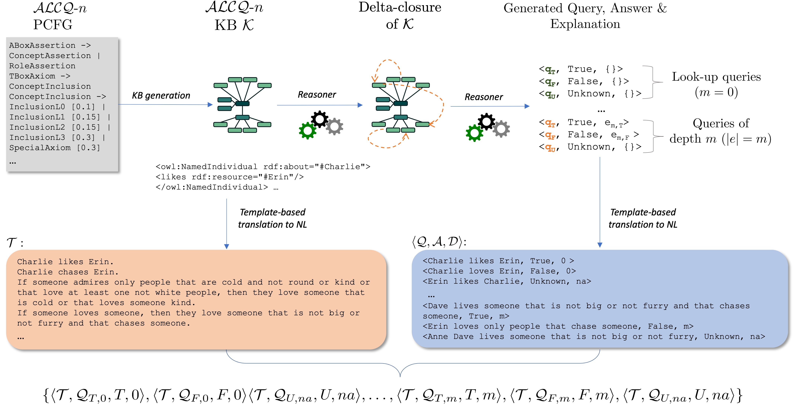

# DELTA: Description Logics with Transformers

Code to produce ALCQ-based knowledge bases as described in our paper: [Transformers in the Service of Description Logic-based Contexts](https://arxiv.org/pdf/2311.08941).
The produced dataset DELTA<sub>D</sub> of 384K examples is included, and the model DELTA<sub>M</sub> that has been trained on DELTA<sub>D</sub> can be accessed through [huggingface](https://huggingface.co/angelosps/delta_m).  

The dataset generation process is illustrated below.



## Knowledge Base generation

Given an `ALCQ Probabilistic Context Free Grammar (PCFG)` the `data_generator.py` will produce `num_of_examples` KBs with questions within the target reasoning depth (`max_depth`).

## Installation

This project requires Python 3 and several libraries, which can be installed with pip:

```
pip3 install -r requirements.txt
```

## Usage

```
python3 data_generator.py --grammar grammars_and_config/ALCQ_grammarsV1/ALCQGrammarL<0/1/2/3>.txt 
                          --config-json grammars_and_config/config/D<1/2/3/5>_config.json 
                          --num-of-examples <n_examples> --max-depth <1/2/3/4/5> 
                          --output-jsonl <output-file-name>.jsonl
```

Where:

* `<grammar-file>` is the path to a text file containing the ALCQ PCFG. Valid options are ALCQGrammarLi.txt for i in {0,1,2,3}.
* `<config-file>` is the path to a JSON file containing the configuration. Valid options are Dj_config.json for j in {0,1,2,3,5}.
* `<n_examples>` is the number of examples (KBs) to generate.
* `<depth>` is the target reasoning depth of the generated questions. Valid options are 1, .., 5.
* `<output-file>` is the name of the JSONL file to output the generated data.

## Citation

If you use our code/dataset in your work please cite our paper:
```
@misc{poulis2024transformers,
      title={Transformers in the Service of Description Logic-based Contexts}, 
      author={Angelos Poulis and Eleni Tsalapati and Manolis Koubarakis},
      year={2024},
      eprint={2311.08941},
      archivePrefix={arXiv},
      primaryClass={cs.CL}
}
```

## Contact

If you encounter any problems or have questions about DELTA, please feel free to contact me at `reverse("angelos") + "ps" + [at]"gmail.com"`.
